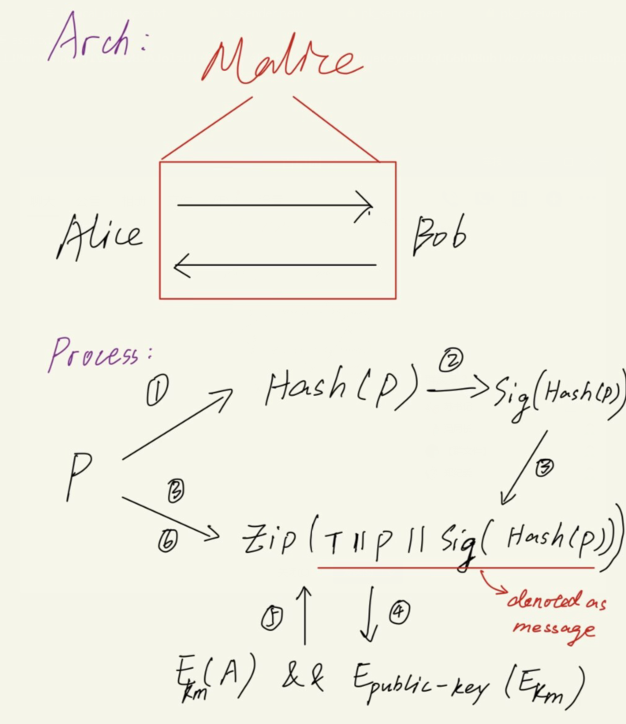
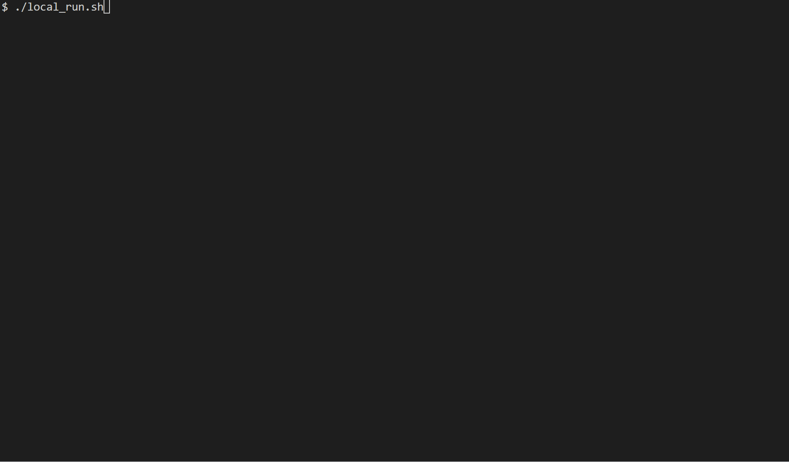

# Introduction
Crypto is a simple encryption and decryption project that uses RSA and SHA256
algorithms to encrypt and decrypt messages(around 1GB). It also uses zlib to 
compress and decompress messages. The tool is written in Python and is compatible
with Python 3.10 and above.

This project is finished by *Kaisuping*, *Cuefe* and *Faith*.

Our design is shown as below:


# Usage
Before use, add permissions to the shell scripts:
- `chmod u+x local_run.sh`
- `chmod u+x client_run.sh`
- `chmod u+x server_run.sh`

If you want to test this on a local machine, 
    run `./local_run.sh`



If you want to test this in client/server mode:
1. In the server, run `./server_run.sh`
2. In the client, run `./client_run.sh`

We use port **5001** as the default port for both server and client in TCP communication.
Make sure it has opened before running the script above. And change the IP address in 
the `client_send.py` according to your requirement.

We also want to containerize the client and server code into separate Docker containers. To help 
you with this, we have prepared a prototype script called `build_and_execute_client.sh && build_and_execute_server.sh` that you can use to build the docker containers when needed.

By the way, If you encouter the network error, maybe you can try `tcpdump -i <Network Adaptor> -w <output file>`,
and then analyze the output file in Wireshark to find the problem.

For convenience, we pass the process of generating and exchanging keys between client and server,
but we do provide interface for generating keys which you can find in `sigh_hash.py` -> `generateKeys()`.

Be careful, you should allocate enough memory for the server, because the server will handle 
large files when decompressing. Otherwise, you may receive a SIGKILL signal like the following:
    `python3 decompress.py terminated by signal SIGKILL (Forced quit)`

# Algorithms
- Hash: sha256
- Compress: zlib
- Signature: rsa, 2048bits
- Symmetric encryption: AES, 256bits

# File structure:
```
./Crypto5.4
├── build_and_execute_client.sh
├── build_and_execute_server.sh
├── client_run.sh
├── Dockerfile-client
├── Dockerfile-server
├── local_run.sh
├── README.md
├── server_run.sh
├── show.gif
├── src
│   ├── acknowledge.py
│   ├── client_receive.py
│   ├── client_send.py
│   ├── compress_message_and_signature.py
│   ├── decode_compressed_message.py
│   ├── decompress.py
│   ├── encode_compressed_message.py
│   ├── extract_plaintext_and_verify_signature.py
│   ├── generate_plaintext_and_hash.py
│   ├── receiver_file
│   │   ├── pk_receiver.pem
│   │   ├── pk_sender.pem
│   │   └── sk_receiver.pem
│   ├── sender_file
│   │   ├── basical_plaintext.txt
│   │   ├── pk_receiver.pem
│   │   ├── pk_sender.pem
│   │   └── sk_sender.pem
│   ├── server_receive.py
│   ├── server_send.py
│   ├── sign_hash.py
│   └── verify_acknowledgement.py
└── testcases
    └── hello.txt

5 directories, 30 files
```